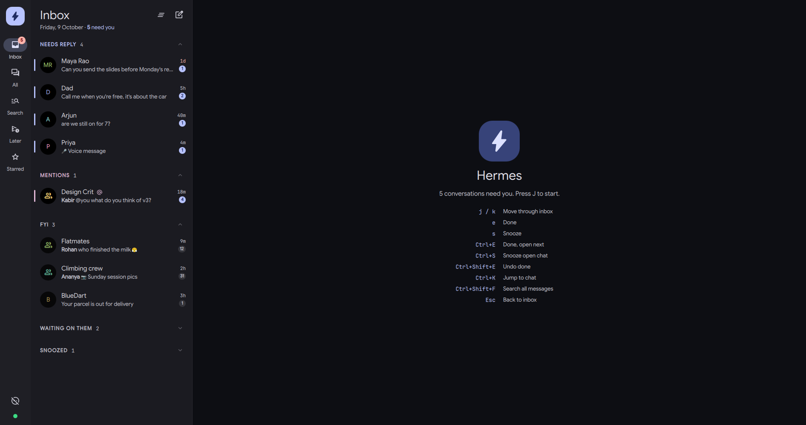
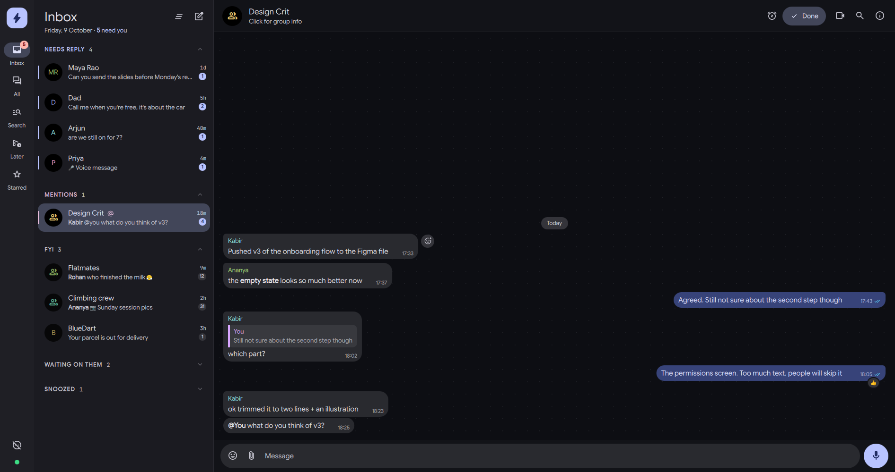
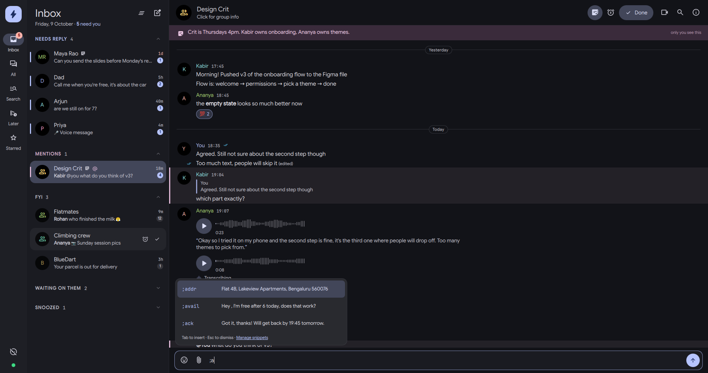
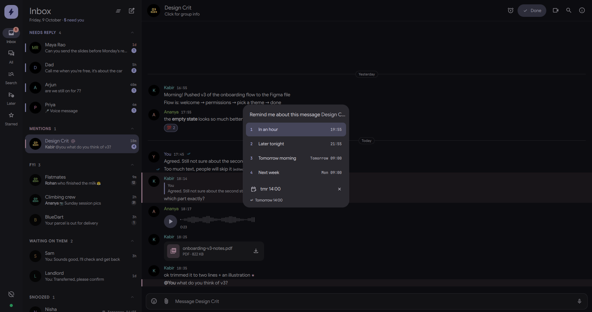
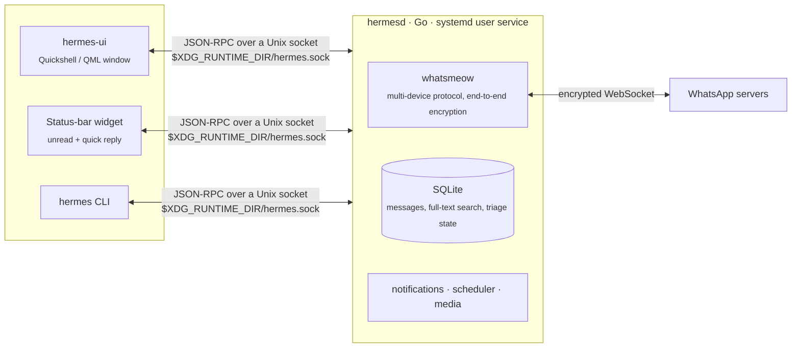

<div align="center">


# Hermes

**A native WhatsApp client for Linux that treats your messages like an inbox, not a feed.**

Built for the [niri](https://github.com/YaLTeR/niri) compositor and [Quickshell](https://quickshell.outfoxxed.me/) desktops.
Keyboard-first, wallpaper-themed, and with a daemon that keeps working when the window is closed.




</div>

> [!WARNING]
> **Hermes is unofficial.** It is not affiliated with, endorsed by, or connected to WhatsApp or Meta.
> It links to your account the same way WhatsApp Web does, using the open-source
> [whatsmeow](https://github.com/tulir/whatsmeow) library. Third-party clients are against WhatsApp's
> Terms of Service and can get an account restricted. Use it with your own account, at your own risk.

---

## Why another WhatsApp client?

Every WhatsApp client, official or not, shows you the same thing: a list of chats sorted by whoever spoke last.
A family group posting memes pushes your manager's question off the screen. You read a message on the bus,
mean to reply later, and it's gone, because "read" looks exactly like "dealt with".

Hermes asks a different question: **what needs you?** It sorts every conversation into a short triage inbox
and lets you clear it with the keyboard, the way an email client like Superhuman or Gmail's "Done" works.
When the inbox is empty, you're actually done.

## The inbox

| Section | What lands here | Why |
|---|---|---|
| **Needs reply** | Someone wrote to you in the last 7 days, and you haven't answered or cleared it | *Read but unanswered* still counts; that's the whole point. Oldest first, so whoever has waited longest is on top. |
| **Mentions** | Someone @-mentioned you or replied to your message in a group | Shows up even in muted groups. Answering or clearing it removes it. |
| **FYI** | Unread group chatter, muted chats, and DMs from senders you've never written to | Delivery updates and verification codes stay out of *Needs reply*. One button clears them all. |
| **Waiting on them** | DMs where you sent the last message (last 3 days) | The ball is in their court. Collapsed by default. |
| **Snoozed** | Chats you've hidden until a time you picked | They come back to *Needs reply* with a notification. A new message brings them back early. |

Everything else is **done**: answered, cleared, muted, archived or older than a week. The full chat list is
still one click away under **All**.

Marking a chat done or snoozing it also marks it read on WhatsApp. Done and snooze themselves live only in Hermes;
your phone shows the chat as normal.

### Conversations read like a transcript

No bubbles and no wallpaper. Messages are left-aligned under the sender's name, the way Slack or a document
reads, so long threads are easy to scan. Anything aimed at you (an @-mention or a reply to your message) gets
an accent bar. Hovering a message shows **react**, **reply**, **remind me** and **more**, and reactions are
chips you click to add or remove your own.



### Voice notes you can read

Incoming voice notes are transcribed on your own machine with [whisper.cpp](https://github.com/ggml-org/whisper.cpp),
in whatever language they're in. Nothing is uploaded anywhere. The transcript appears under the player, in the inbox
preview, in notifications, and in search, so you can find "that voice note about the flat" weeks later.
Older voice notes can be transcribed from the message menu.

### Notes and snippets

Every chat can have a **private note**, a strip under the header for context like "manager, prefers short updates"
or a birthday. It's stored only in Hermes and never sent. Chats with a note show a small icon in the inbox.

**Snippets** are text you reuse. Type `;` in a message and pick one, or type `;addr` and a space to expand it.
`{first}`, `{date}` and `{time}` are filled in for the chat you're in. Manage them from `Ctrl+K` → *Manage snippets*.
Nothing is sent until you press Enter.



### Snooze and remind me

Pick a preset with a number key, or just start typing a time: `in 2h`, `tonight`, `tmr 14:00`, `fri 9am`, `18:30`.
A reminder on a specific message shows that message in the inbox, and opening the chat jumps straight to it.



### Keyboard

| Key | Action | | Key | Action |
|---|---|---|---|---|
| `j` / `k` | Move through the inbox | | `Ctrl+E` | Done, and open the next chat |
| `Enter` | Open chat | | `Ctrl+S` | Snooze the open chat |
| `e` | Done | | `Ctrl+Shift+E` | Undo done |
| `s` | Snooze (`1`–`6` picks a time) | | `Ctrl+Tab` | Next chat in the inbox |
| `u` | Mark unread | | `Ctrl+K` | Command palette: jump to any chat or action |
| `Shift+E` | Undo | | `Esc` | Back to the inbox |

In a chat: `Enter` sends, `Shift+Enter` adds a new line, `Ctrl+Enter` schedules, `↑` edits your last message,
and right-clicking a message gives **Remind me about this…**

## Everything else it does

- **Messaging:** text with `*bold*` `_italic_` `~strike~` `` `code` `` formatting, replies, mentions, reactions,
  editing, delete for everyone or for you, forwarding, starring, polls (create, vote, live results).
- **Media:** photos, video, GIFs, voice notes (record from your mic, waveform, 1×/1.5×/2× playback,
  local transcription), documents, stickers (including animated), locations and contact cards. Drag and drop files to send them.
  Media that WhatsApp has expired is re-requested from your phone, like the official apps do.
- **Stays in sync with your phone:** archive, pin, mute and read state go both ways. History syncs when you link,
  and older history is fetched on demand. Delivery and read ticks, typing indicators, online status.
- **Search:** full-text search across every chat, plus a starred-messages view.
- **Later:** schedule a message for a specific time; the daemon sends it even if the window is closed.
- **Focus mode:** silence notifications from everyone except a VIP list.
- **Desktop:** notifications grouped per chat with *Open* and *Mark read* buttons, a status-bar widget that
  counts the chats that need you (with quick reply, and middle-click to mark done), a niri keybind, and Material 3 colours that follow your wallpaper.
- **Terminal:** a `hermes` CLI for scripts and status bars (see below).

**Not supported:** voice and video calls (no open-source implementation exists; Hermes shows the incoming
call and tells you to pick up on your phone) and WhatsApp Pay.

## How it works



**Linking.** Hermes registers as a *linked device* on your account, exactly like WhatsApp Web or the
desktop app. You scan a QR code (or type a pairing code) from *WhatsApp → Linked devices* on your phone.
After that your phone doesn't need to be online.

**The daemon does the work.** `hermesd` runs in the background as a systemd user service. It holds the
connection, decrypts messages, stores them, downloads media and sends notifications. The window, the bar widget
and the CLI are thin clients that talk to it over a local socket. So you get notifications with no window
open, scheduled messages go out on time, and the UI can be closed or restarted without losing anything.

**Your data stays on your machine.** Messages, media and encryption keys live in `~/.local/share/hermes`
(a SQLite database and a media folder). Nothing goes anywhere except to WhatsApp itself. That folder is
never part of this repository.

**Triage is computed, not stored per message.** For each chat the daemon tracks a few timestamps:
when you last replied, when you were last mentioned, when you marked it done, and when a snooze ends.
It works out the inbox section from those whenever a chat changes. The rules are a small pure function
(`store.Bucket`) with unit tests.

**Keeping up with WhatsApp.** WhatsApp changes its protocol often. Hermes checks the current WhatsApp Web
version every six hours and reconnects with it when the server says the client is outdated. It also checks
daily for updates to the whatsmeow library and tells you when to run `hermes-update`, which updates,
tests, rebuilds and restarts, and rolls back if anything fails.

**Playing nice.** Every outgoing message is one you wrote or explicitly scheduled. There are no auto-replies,
bulk sends or scraping, and scheduled messages are spaced out so nothing bursts. Hermes only shows you as
online while its window is focused, so your phone keeps getting push notifications.

## Install

You need Linux on Wayland with **Go 1.27+**, **Quickshell 0.3+** (Qt 6.8), **ffmpeg**, **mpv** and **PipeWire**.
Everything installs into `~/.local`; no root needed.

```sh
git clone https://github.com/AaditPani-RVU/hermes.git
cd hermes
./install.sh          # builds the daemon and CLI, installs the UI, enables the hermesd user service
hermes pair           # shows a QR code: WhatsApp on your phone → Linked devices → Link a device
hermes-ui             # opens the window (niri users get Mod+Ctrl+W)
```

Optional extras:

```sh
hermes-whisper-setup --cuda   # voice-note transcription on an NVIDIA GPU (large-v3-turbo, ~5 s per note)
hermes-whisper-setup          # or CPU only (small model, similar speed, less accurate for mixed languages)
```

and `qt6-image-formats-plugins` for native animated WebP stickers.

Hermes picks up colours from Clavis Shell's matugen output if it's there, and falls back to a built-in dark
theme otherwise.

## CLI

```text
hermes inbox                      what needs you, grouped like the app
hermes done "Maya"                clear a chat from the inbox
hermes send "Dad" "on my way"     send a message (chat = name, number or JID)
hermes file "Maya" slides.pdf     send a file
hermes search invoice             full-text search across every chat
hermes schedule "Arjun" 18:30 "leaving now"
hermes note "Maya" "prefers short updates"   private note on a chat
hermes snippet addr "Flat 4B, Lakeview Apartments"   then type ;addr in the app
hermes unread --json              counts for status bars
hermes focus on 2h                only VIPs can notify you for two hours
hermes updates                    check WhatsApp / library update status
```

## Project layout

| Path | What's in it |
|---|---|
| [`daemon/`](daemon) | `hermesd` and the `hermes` CLI in Go: WhatsApp connection, storage, RPC, notifications, scheduler |
| [`ui/`](ui) | The Quickshell app: `Services/` (daemon connection, theme), `Components/`, `Views/` |
| [`clavis-module/`](clavis-module) | Status-bar widget for Clavis Shell |
| [`packaging/`](packaging) | systemd unit, launcher, updater, desktop entry, niri keybind |
| [`PLAN.md`](PLAN.md) | Design notes, feature matrix, roadmap and a dated progress log |

## Roadmap

- [x] Full messaging and media, sync with phone, search, scheduling, focus mode
- [x] Triage inbox with done, snooze and remind-me
- [x] Transcript-style conversation view, typed snooze times, message reminders
- [x] Voice-note transcription that runs locally (whisper.cpp)
- [x] Private per-chat notes and text snippets
- [ ] Replying straight from notifications
- [ ] Status (stories), channels, group admin, privacy settings

## Credits

Hermes stands on [whatsmeow](https://github.com/tulir/whatsmeow) by Tulir Asokan, which does the protocol and
encryption work, and on [Quickshell](https://quickshell.outfoxxed.me/) for the UI. Icons are
[Material Symbols](https://fonts.google.com/icons).
